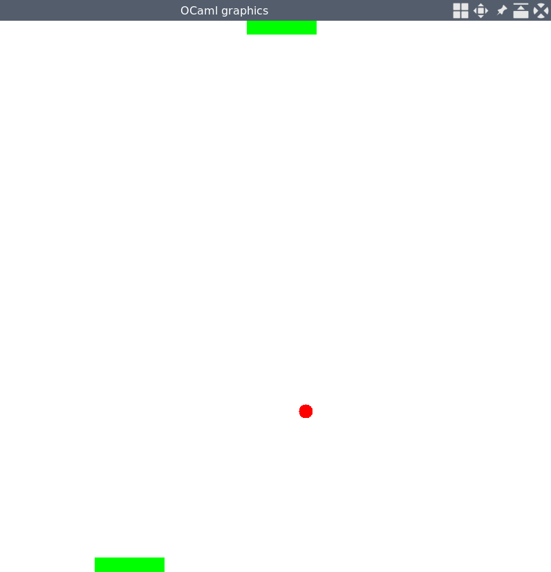

Implementation of PONG using [OCaml](http://ocaml.org/). Tested under Linux with OCaml 4.06, Windows may not be supported.

Compilation is done via:
```bash
ocamlbuild -package graphics -package unix pong.native
```
As you can see we use the [Graphics package](https://caml.inria.fr/pub/docs/manual-ocaml/libref/Graphics.html) for visualization. 
*unix* is used for delay.
Speed of the bar depends partially on the refresh rate of your keyboard.
Adjusting can be done with:
```bash
xset r rate 250 60
```
First argument is delay, second is refresh rate. 100 for delay and 50 for refresh rate is good. 

Execution via:
```bash
./pong.native
```
The bar can be moved with **a** and **d**.


